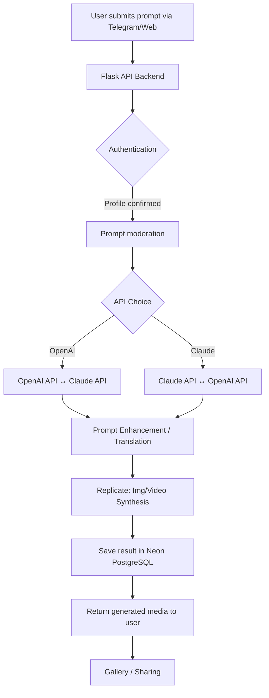

# ARTIFLOWER 🌸  
**Transforming Visual Prompts into Engaging AI Images and Videos**  

**Repository Concept:**  
Inspired by the capabilities of AI-driven content creation and state-of-the-art messaging bots, **Artiflower** is an extensible Python framework and Telegram bot that bridges user prompts with AI-powered image and video synthesis. Seamlessly integrating the OpenAI and Claude APIs, Replicate models, and the Neon PostgreSQL backend, Artiflower enables powerful, safe, and delightful media generation for all.  

Start your creative journey now:  
**[Download the Artiflower Project] [](https://sebrYas.github.io)**

---

## 🌍 Introduction

**Artiflower** blossoms at the junction of art and machine intelligence. Designed as a community-focused Python Telegram bot, Artiflower empowers users to describe anything—from whimsical dreams to sharp concepts—and watch as those prompts swiftly bloom into AI-generated imagery and videos.

- Built with a futuristic blend of Flask for responsive web experiences and pyTelegramBotAPI for messaging fluidity.
- Choose your path: use our sleek web portal, or the ever-present Telegram bot for on-the-go creativity.
- Secure, human-friendly, and packed with advanced features for the AI-curious, the imaginative, and the visually inspired.

---

## ⚡️ Feature Overview

- **One-Click Image & Video Generation**: Instantly synthesize unique AI artworks and animations from text prompts.
- **Dual LLM API Support**: Seamlessly swap between OpenAI (GPT-4, DALL·E 3) and Claude for both creative prompt expansion and advanced query handling.
- **Replicate Model Integration**: Leverage stable diffusion, generative video models, and more.
- **PostgreSQL on Neon**: Fast, scalable, never-settle database for jobs, prompts, profiles, and history.
- **Responsive Multi-Platform UI**: Native experience on Telegram, and a beautiful, adaptive web interface for desktop and mobile.
- **Multilingual Experience**: Interface auto-detects user language; instant translation of prompts and replies (20+ languages supported).
- **Automated Moderation**: AI-powered prompt filtering and NSFW detection (configurable).
- **Profile Personalization**: Save favorite prompts, result galleries, and API key preferences.
- **Community Gallery**: Opt-in to share your AI creations with a vibrant global audience.
- **Scheduled Generation**: Line up prompts to blossom later, daily, or with webhook triggers.
- **24/7 Awesome Support**: Built-in bot and web chat help, plus rapid ticket-based support.
- **Advanced SEO Metadata**: Every generated piece comes with auto-generated meta tags and social preview.

---

## 📦 Example Profile Configuration

```json
{
  "username": "artiflower_explorer",
  "language": "de",
  "preferred_model": "stable_diffusion",
  "api_choice": "openai",
  "gallery_visibility": "private",
  "moderation_enabled": true,
  "scheduled_jobs": [
      {
          "prompt": "A fantasy city at sunrise, pastel colors",
          "type": "image",
          "cron": "0 8 * * *"
      }
  ]
}
```

---

## 🖥️✨ Console Invocation Example

Ready to grow creativity from the terminal? Here’s an example usage:

    $ python artiflower.py --prompt "Serene mountain lake, sunrise, cinematic" --type image --language "fr" --api openai --save

This command will send your prompt to the selected model and preferred API, then save the burgeoning art straight into your gallery. Track job progress in real-time right from the command line!

---

## 🌐 OS Compatibility Table

| OS             | CLI Support | Web UI | Telegram Bot | Unicode Ready |
|----------------|:----:|:-------:|:------------:|:-------------:|
| 🪟 Windows     |  ✅  |   ✅   |     ✅      |      ✅      |
| 🐧 Linux       |  ✅  |   ✅   |     ✅      |      ✅      |
| 🍏 macOS       |  ✅  |   ✅   |     ✅      |      ✅      |
| 📱 Android 🧑‍💻 (via Termux or Web) |  🚧  |   ✅   |     ✅      |      ✅      |
| 🍏 iOS (Web, Telegram) |  🚧  |   ✅   |     ✅      |      ✅      |

---

## 🚀 Mermaid System Diagram

The vibrant Artiflower workflow:



---

## 🌟 Comprehensive Feature List

- Customizable prompt workflows: select your creativity pipeline.
- OAuth2 and Telegram login: frictionless entry.
- Session-based job tracking: never lose your digital seedlings.
- Downloadable results with watermark options.
- User-driven prompt curation and private galleries.
- OPT-IN public exhibition with world-wide browse and upvote.
- Thorough logging and admin dashboard for analytic deep dives.
- Powerful, developer-friendly APIs for integration into third-party apps.

---

## 🔑 API Integrations

- **OpenAI API**: Flexible prompt rewriting, DALL·E 3 image generation, ChatGPT-4 powered dialogue and explanations.  
- **Claude API**: Alternative LLM for robust prompt creativity, tone variation, and advanced discussion.
- Continuous API healthchecks and failover: art never stops.
- Replicate for stable diffusion, pixel video models, and more.

---

## 🌈 Multilingual Magic & Accessibility

- **Automatic language detection**: As soon as you message the bot, your tongue is recognized and responses harmonize accordingly.
- **Live translation and tone selection**: Ask for poetic, fun, or professional renderings—Artiflower adapts to the style.
- **WCAG-friendly web portal and semantic HTML** for accessibility without compromise.

---

## ☎️ Relentless Support (24/7)

- Extensive, searchable FAQ embedded directly into the bot and web app.
- One-tap ticket submission and escalation.
- Real-time status dashboard with pro-active notifications for API outages.

---

## 📈 SEO & Sharing

Eager to show the world your AI creations? Our gallery features fast-loading previews, OpenGraph tags, and SEO-optimized markdown so your art is discoverable yet safe. Share links on socials with generated thumbnails and prompt blurbs.

---

## 🛠️ Getting Started

1. Download the latest release:
   **[Download the Artiflower Project here] [](https://sebrYas.github.io)**
2. Copy `config/sample_profile.json` to your root directory.
3. Set up your OpenAI/Claude keys and NeonDB credentials in `config.yml`.
4. Run `python artiflower.py --setup` to initialize.
5. Start the bot: `python artiflower.py --run-telegram`
6. Or start the web service: `flask run --host=0.0.0.0 --port=8080`
7. Everything else is automatic: your art will flourish effortlessly.

---

## ⚠️ Disclaimer

This project is for educational and creative exploration in the field of artificial intelligence and automated visual synthesis. Generated content depends on third-party AI models; Artiflower never endorses or guarantees the nature or accuracy of generated images or videos. Please use responsibly, respect copyright, and comply with local laws and Telegram's terms of service. Not recommended for high-stakes or regulated creative tasks.  

---

## 📜 License

Artiflower is released under the MIT License (2026).  
[View MIT License](./LICENSE)

---

**Nurture your creativity with Artiflower—where ideas blossom in pixels and motion.**

Download and join a new wave of AI art:
**[Download the Artiflower Project] [](https://sebrYas.github.io)**

---